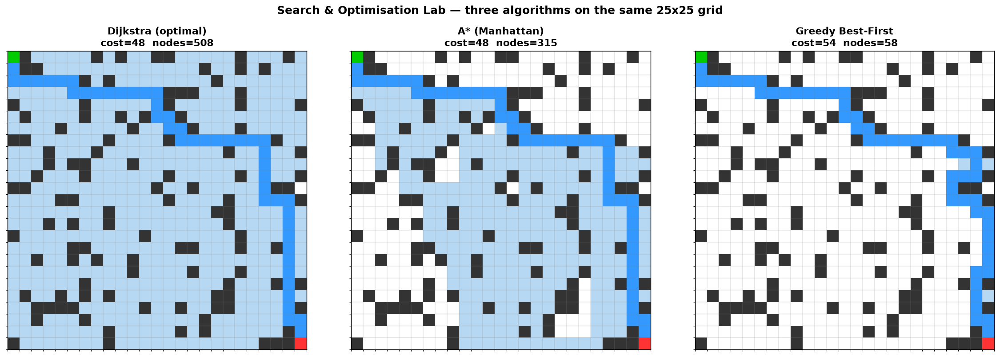

# Search & Optimisation Algorithm Lab

[](https://github.com/alanzhang/search_optimisation_lab/actions/workflows/tests.yml)
[](https://www.python.org)

An interactive lab for implementing, visualising, and benchmarking classical
graph-search algorithms, metaheuristic optimisers, exact dynamic-programming
solvers, and a **learned (machine-learning) heuristic for A\***.



*Dijkstra (optimal, 185 nodes) | A\* with Manhattan (optimal, 132 nodes) | Greedy Best-First (suboptimal, 54 nodes) — same grid, same start/goal, three very different exploration patterns.*

## Algorithms

| Category | Algorithms |
|---|---|
| **Uninformed Search** | BFS, DFS |
| **Informed Search** | Dijkstra, A\*, Greedy Best-First |
| **Metaheuristics** | Genetic Algorithm, Simulated Annealing |
| **Dynamic Programming** | Floyd-Warshall (all-pairs shortest paths), Held-Karp (exact TSP) |
| **Machine Learning** | Learned heuristic via linear regression on h\*(n) |

## Setup

```bash
python3 -m venv venv
source venv/bin/activate
pip install -e ".[test]"
```

## Run the Visualiser

```bash
streamlit run app.py
```

Navigate between pages using the sidebar:
- **Pathfinding Explorer** — compare BFS / DFS / Dijkstra / A\* / Greedy on random grids
- **Metaheuristics** — GA and SA with tunable parameters and convergence plots
- **Benchmark Summary** — aggregated metrics from systematic experiments
- **Dynamic Programming** — Floyd-Warshall all-pairs shortest paths and Held-Karp exact TSP solver
- **Heuristic Quality** — heuristic-weight sweep, inadmissible failure cases, and a formal proof of A\* optimality
- **Dijkstra vs A\*** — side-by-side exploration patterns and a scaling experiment
- **Weighted Graphs** — algorithms on general weighted graph topologies (not grids)
- **Learned Heuristic** — train a linear model on Dijkstra-labelled data and use it as an A\* heuristic; analyse the speed-up vs suboptimality trade-off

## Run Benchmarks

```bash
python experiments/run_benchmarks.py
```

This generates `experiments/results.csv`, which the Benchmark Summary page reads.

## Run Tests

```bash
pytest tests/ -v
```

## Project Structure

```
search_optimisation_lab/
├── app.py                    # Streamlit entry point
├── pyproject.toml            # Package metadata & test config
├── src/
│   ├── graph.py              # Grid and Graph representations
│   ├── algorithms/           # BFS, DFS, Dijkstra, A*, Greedy, GA, SA,
│   │                         # Floyd-Warshall, Held-Karp, learned heuristic
│   └── visualisation/        # Grid drawing and metrics helpers
├── pages/                    # Streamlit multi-page modules
├── experiments/              # Benchmarking scripts + results.csv
├── tests/                    # pytest test suite (39 tests)
├── report/                   # Report document and figures
└── .github/workflows/        # CI: runs pytest on push
```

## Overview of the Learned Heuristic

The headline experiment trains a linear model to predict the *true remaining
cost* `h*(n)` from lightweight geometric features (Manhattan/Euclidean distance,
local obstacle density, degree, distance to nearest wall, goal alignment).
Labels come from Dijkstra.  The model is trained from scratch with mini-batch
gradient descent (no scikit-learn) so the mathematics is explicit.

Because the learned heuristic is **not** guaranteed admissible, the resulting
search is a *bounded-suboptimal* planner — the same regime as weighted A\*.  The
**Learned Heuristic** page measures the resulting speed-up versus the
suboptimality ratio across many unseen grids, illustrating the core AI-planning
trade-off between search effort and solution quality.