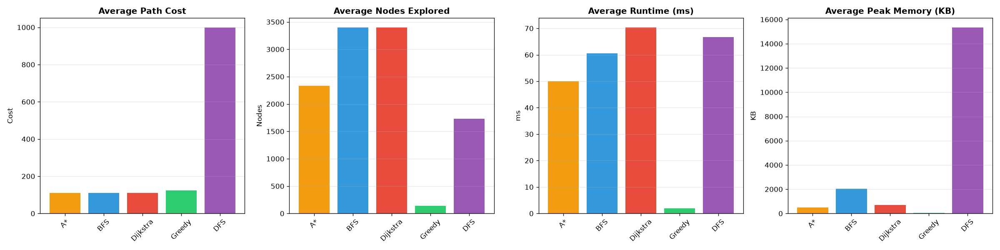
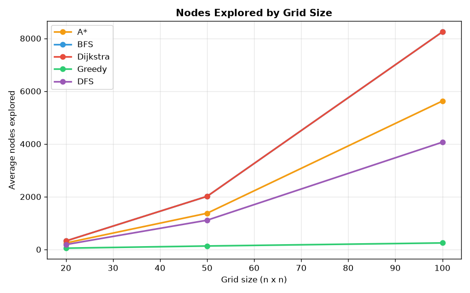
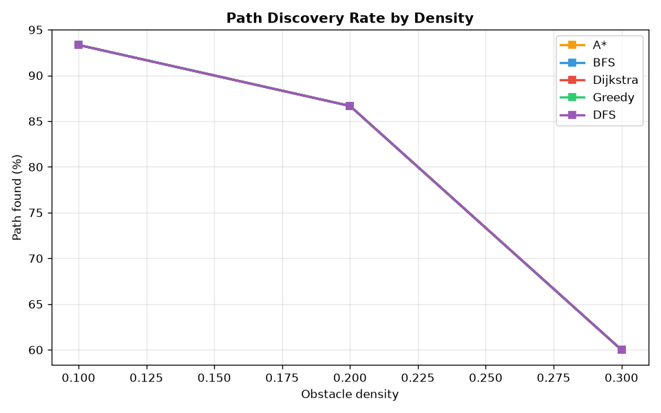
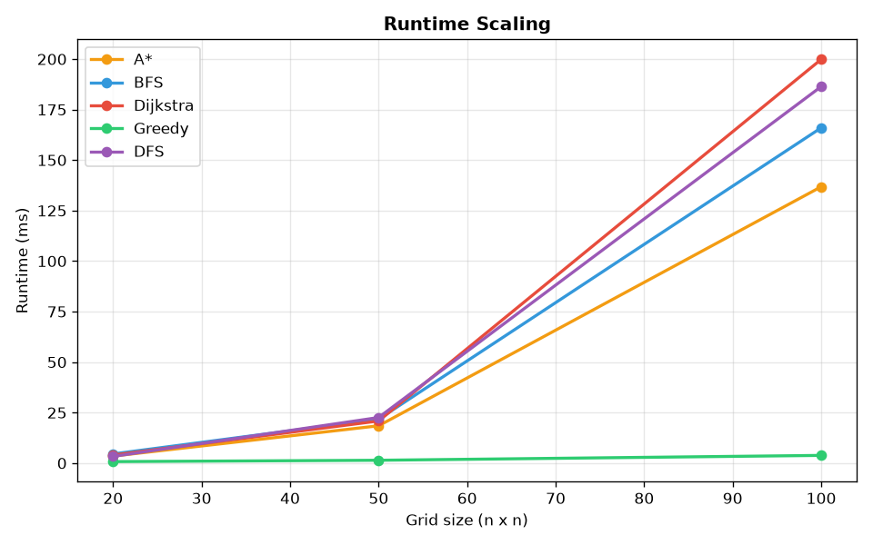
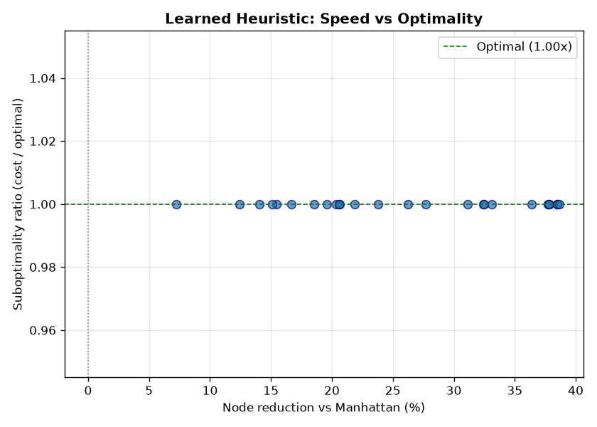

# Search and Optimisation Algorithm Lab — Report

## 1. Introduction

This project implements, visualises, and benchmarks five classical graph-search
algorithms, two metaheuristic optimisers, two exact dynamic-programming
solvers, and a **learned heuristic** that uses supervised machine learning to
predict the cost-to-go for A\*.  The goal is to understand the practical
trade-offs between uninformed search, informed search, approximate optimisation,
and learning-based heuristic design by running controlled experiments on
randomly generated grid mazes.

The algorithms studied are:

| Category | Algorithms |
|---|---|
| Uninformed search | Breadth-First Search (BFS), Depth-First Search (DFS) |
| Informed search | Dijkstra's algorithm, A\*, Greedy Best-First Search |
| Metaheuristics | Genetic Algorithm (GA), Simulated Annealing (SA) |
| Dynamic programming | Floyd-Warshall (all-pairs shortest paths), Held-Karp (exact TSP) |
| Machine learning | Learned heuristic via linear regression on h\*(n) |

All implementations are from scratch in Python (including the gradient-descent
linear model, which uses only numpy), with an interactive Streamlit visualiser
for exploration and a benchmarking harness for systematic comparison.

### Relation to AI

Graph search and heuristic planning are foundational topics in artificial
intelligence (Russell & Norvig, *Artificial Intelligence: A Modern Approach*,
Ch. 3–4).  A\* with an admissible heuristic is the canonical *optimal* search
algorithm; weighted A\* and the learned-heuristic experiment in this lab sit in
the *bounded-suboptimal* regime that underpins much of modern automated
planning.  The metaheuristics demonstrate how AI tackles problems too large for
exact methods, and the dynamic-programming solvers show where exactness remains
tractable.  Together, the lab traces the arc from uninformed search through
informed search, learning-augmented search, metaheuristics, and exact DP — a
representative cross-section of an undergraduate AI course.

## 2. Algorithm Background

### 2.1 Breadth-First Search (BFS)

BFS explores all nodes at the current depth before moving deeper.  It uses a FIFO queue and guarantees the shortest path on unweighted graphs.

- **Time complexity:** O(V + E)
- **Space complexity:** O(V)
- **Optimality:** Yes (unweighted graphs)

### 2.2 Depth-First Search (DFS)

DFS explores as deep as possible along each branch before backtracking.  It uses a LIFO stack and does not guarantee shortest paths.

- **Time complexity:** O(V + E)
- **Space complexity:** O(V) worst case
- **Optimality:** No

### 2.3 Dijkstra's Algorithm

Dijkstra's algorithm extends BFS to weighted graphs by using a priority queue keyed on accumulated cost g(n).  It always expands the cheapest-known node and guarantees optimal paths with non-negative weights.

- **Time complexity:** O((V + E) log V) with a binary heap
- **Space complexity:** O(V)
- **Optimality:** Yes (non-negative weights)

### 2.4 A\* Search

A\* combines Dijkstra's accumulated cost g(n) with a heuristic estimate h(n) of the remaining cost, using f(n) = g(n) + h(n) as the priority.  With an admissible heuristic (one that never overestimates), A\* is optimal and typically explores far fewer nodes than Dijkstra.

- **Time complexity:** O((V + E) log V), but with pruning from the heuristic
- **Space complexity:** O(V)
- **Optimality:** Yes (with admissible heuristic)

Three hand-crafted heuristics are implemented:
- **Manhattan distance:** |x1 - x2| + |y1 - y2| — admissible for 4-directional grids
- **Euclidean distance:** sqrt((x1 - x2)^2 + (y1 - y2)^2) — admissible for all grids
- **Chebyshev distance:** max(|x1 - x2|, |y1 - y2|) — admissible for 8-directional grids

A *learned* heuristic (Section 2.10) is also provided.

### 2.5 Greedy Best-First Search

Greedy Best-First uses only h(n) as the priority, ignoring accumulated cost.  It tends to reach the goal quickly but may produce suboptimal or even long, winding paths.

- **Time complexity:** O((V + E) log V)
- **Space complexity:** O(V)
- **Optimality:** No

### 2.6 Genetic Algorithm (GA)

A population-based metaheuristic that encodes candidate paths as sequences of movement directions.  Each generation applies tournament selection, single-point crossover, and per-gene mutation.  Fitness is based on proximity to the goal and path length.

- **Time complexity:** O(generations × population_size × path_length)
- **Optimality:** No guarantee; approximate

### 2.7 Simulated Annealing (SA)

A neighbourhood-search method that starts from a greedy initial path and iteratively perturbs it.  Worse solutions are accepted with probability exp(−Δ/T), where T decreases over time following a geometric cooling schedule.

- **Time complexity:** O(iterations × path_length)
- **Optimality:** No guarantee; approximate

### 2.8 Floyd-Warshall Algorithm

An all-pairs shortest paths algorithm that computes the optimal distance between every pair of nodes simultaneously.  It uses a three-nested-loop relaxation over intermediate nodes.

- **Time complexity:** O(V^3)
- **Space complexity:** O(V^2)
- **Optimality:** Yes (exact)

**Why it stops being practical.**  On an n×n grid the number of passable vertices
is V ≈ n², so the distance matrix holds V² = n⁴ floats.  At 8 bytes per float:

| Grid | V (nodes) | V² floats | Memory | O(V³) ops |
|---|---|---|---|---|
| 10×10 | 100 | 10,000 | 80 KB | 1.0 × 10⁶ |
| 15×15 | 225 | 50,625 | 405 KB | 1.1 × 10⁷ |
| 20×20 | 400 | 160,000 | 1.3 MB | 6.4 × 10⁷ |
| 30×30 | 900 | 810,000 | 6.5 MB | 7.3 × 10⁸ |

Beyond ~15×15 the cubic time and quadratic memory make the method prohibitive.
Its advantage is that once computed, any source–target query is answered in
O(V) path-reconstruction time rather than requiring a fresh search.

### 2.9 Held-Karp Algorithm (Exact TSP)

The Held-Karp algorithm solves the Travelling Salesman Problem exactly using dynamic programming with bitmask subsets.  It considers all possible subsets of cities and finds the minimum-cost Hamiltonian cycle.

- **Time complexity:** O(2^n · n²)
- **Space complexity:** O(2^n · n)
- **Optimality:** Yes (exact)

This is practical for up to ~20 cities.  At 20 cities the bitmask has 2²⁰ ≈ 1.05 × 10⁶ states, each storing n = 20 entries — about 160 MB for the DP table.  For the grid TSP variant, Floyd-Warshall first computes pairwise shortest distances between waypoints, then Held-Karp finds the optimal tour.

### 2.10 Learned Heuristic (Machine Learning)

Instead of a hand-crafted heuristic, we **learn** one from data.  The pipeline:

1. **Sample** many (grid, node, goal) triples.
2. **Label** each with the true remaining cost h\*(n) computed by Dijkstra — a trustworthy teacher.
3. **Extract features** for each node: Manhattan and Euclidean distance to goal, open-neighbour degree, local obstacle density (3×3 window), distance to nearest wall, and a goal-direction alignment term.
4. **Train** a linear model h_θ(n) = θ · x(n) by mini-batch gradient descent on the MSE loss, with features and target standardised for numerical conditioning.
5. **Deploy** the learned value directly as the A\* heuristic.

Because the learned heuristic is **not** guaranteed admissible, the resulting
search is a *bounded-suboptimal* planner — the same regime as weighted A\*
(Section 5.6).  The experiments measure the resulting speed-up versus the
suboptimality ratio.  The linear model is implemented from scratch in numpy so
the gradient-descent update rule is explicit and inspectable.

## 3. Implementation Design

### 3.1 Grid Representation

The `Grid` class models a 2D maze where each cell is passable (0) or blocked (1).  It supports:
- Configurable rows, columns, and obstacle density
- Optional per-cell weights for weighted pathfinding
- 4-directional or 8-directional (diagonal) movement
- Seeded random generation for reproducibility

Neighbours are computed on the fly with bounds and passability checks.  Diagonal moves incur a √2 multiplier on the base weight.

### 3.2 Algorithm Modules

Each algorithm lives in its own module under `src/algorithms/` and returns a dataclass containing:
- The path (list of (row, col) tuples)
- The list of explored nodes (in exploration order)
- Metrics: path length, path cost, nodes explored, runtime, peak memory

This uniform interface allows the visualiser and benchmarking harness to treat all algorithms identically.  A shared `track_memory` context manager (using `tracemalloc`) provides peak-memory measurements consistently across search algorithms.

### 3.3 Visualiser

The Streamlit app provides **eight** pages:

1. **Pathfinding Explorer** — configurable grid with multi-algorithm comparison, side-by-side grid plots, and a metrics table with summary indicators (lowest cost, fastest, fewest nodes).
2. **Metaheuristics** — GA and SA with tunable parameters alongside an A\* baseline, plus convergence plots (fitness over generations for GA, cost over iterations for SA).
3. **Benchmark Summary** — loads precomputed CSV results, provides interactive filters by grid size and density, and displays aggregated bar charts.  Averages are computed over *successful* runs only, so a failed (no-path) run never drags the mean down.
4. **Dynamic Programming** — two tabs: Floyd-Warshall computes all-pairs shortest paths on small grids and compares against A\*; Held-Karp solves exact TSP on user-placed waypoints, visualised with numbered cities and directional arrows showing the optimal tour.
5. **Heuristic Quality** — sweeps the Manhattan heuristic by a weight factor w, classifies each weight as admissible/inadmissible, shows bad-heuristic failure cases, and presents a formal proof of A\* optimality.
6. **Dijkstra vs A\*** — dedicated head-to-head comparison with side-by-side exploration patterns and a scaling experiment from 10×10 to 100×100.
7. **Weighted Graphs** — runs algorithms on general weighted graph topologies (not grids), including preset city maps and random topologies with visible edge weights.
8. **Learned Heuristic** — the machine-learning page: generate Dijkstra-labelled training data, train a linear model with gradient descent, inspect the loss curve and learned weights, and evaluate the speed-up vs suboptimality trade-off on unseen grids.

Grid visualisations use Matplotlib with colour coding: dark grey for obstacles, light blue for explored cells, blue for the path, green for start, red for goal.

## 4. Experimental Methodology

### 4.1 Scenarios

Benchmarks were run across a factorial design:
- **Grid sizes:** 20×20, 50×50, 100×100
- **Obstacle densities:** 10%, 20%, 30%
- **Random seeds:** 0 through 4 (5 trials per configuration)

Start is always (0, 0) and goal is (n−1, n−1).  All grids use unit weights and 4-directional movement.

### 4.2 Algorithms Tested

BFS, DFS, Dijkstra, A\* (Manhattan heuristic), and Greedy Best-First (Manhattan heuristic).

### 4.3 Metrics

- **Path length:** number of cells in the returned path
- **Path cost:** sum of edge weights along the path (consistent edge-sum semantics across all algorithms); `inf` when no path is found
- **Nodes explored:** number of nodes removed from the frontier
- **Runtime:** wall-clock time via `time.perf_counter()`, reported in milliseconds
- **Peak memory:** measured via `tracemalloc`, reported in KB
- **Path found:** whether the algorithm reached the goal

Cost averages are computed over *successful* runs only; failed runs record a
path cost of `inf` and are excluded from the mean so that the average reflects
genuine solution quality.

### 4.4 Total Runs

3 sizes × 3 densities × 5 seeds × 5 algorithms = **225 runs**.

## 5. Results

### 5.1 Overall Performance

| Algorithm | Avg Path Cost | Avg Nodes Explored | Avg Runtime (ms) | Path Found (%) |
|---|---|---|---|---|
| A\* | 110.72 | 2,329 | 50.05 | 80.0 |
| BFS | 110.72 | 3,401 | 60.57 | 80.0 |
| Dijkstra | 110.72 | 3,401 | 70.40 | 80.0 |
| Greedy | 123.44 | 142 | 1.94 | 80.0 |
| DFS | 1,000.22 | 1,731 | 66.76 | 80.0 |

**Key observations:**
- A\*, BFS, and Dijkstra produce identical optimal costs (110.72), confirming correctness.
- A\* explores 32% fewer nodes than Dijkstra (2,329 vs 3,401), demonstrating the value of the Manhattan heuristic.
- BFS matches Dijkstra's node count (expected on unit-weight grids) but is faster due to simpler O(1) queue operations.
- Greedy explores dramatically fewer nodes (142) but at an 11% cost penalty (123.44 vs 110.72).
- DFS produces paths ~9× longer than optimal (1,000 vs 111), confirming it is unsuitable for shortest-path problems.

### 5.2 Scaling with Grid Size

| Algorithm | 20×20 Nodes | 50×50 Nodes | 100×100 Nodes |
|---|---|---|---|
| A\* | 247 | 1,374 | 5,626 |
| BFS | 322 | 2,013 | 8,246 |
| Dijkstra | 322 | 2,014 | 8,246 |
| Greedy | 50 | 132 | 248 |
| DFS | 187 | 1,109 | 4,066 |

Greedy's node count grows much more slowly than the others because it follows the heuristic directly toward the goal.  A\*'s advantage over Dijkstra/BFS becomes more pronounced at larger sizes: at 100×100, A\* explores 32% fewer nodes.

### 5.3 Effect of Obstacle Density

All algorithms have identical path-found rates (since they explore the same reachable set):
- 10% density: 93.3% found
- 20% density: 86.7% found
- 30% density: 60.0% found

Higher density increases the chance that no path exists between opposite corners.

### 5.4 Runtime Scaling

| Algorithm | 20×20 (ms) | 50×50 (ms) | 100×100 (ms) |
|---|---|---|---|
| A\* | 3.47 | 18.48 | 136.82 |
| BFS | 4.55 | 21.75 | 165.99 |
| Dijkstra | 3.98 | 20.87 | 199.87 |
| Greedy | 0.75 | 1.41 | 3.82 |
| DFS | 3.31 | 22.59 | 186.41 |

Dijkstra's overhead from the priority queue becomes visible at scale: at 100×100 it is ~20% slower than BFS despite exploring the same nodes, because heap operations are more expensive than deque operations.  DFS is the slowest at 100×100 because it explores long, wasteful paths.

### 5.5 Memory Usage

| Algorithm | 20×20 (KB) | 50×50 (KB) | 100×100 (KB) | Overall Avg (KB) |
|---|---|---|---|---|
| Greedy | 10.9 | 34.1 | 64.5 | 36.3 |
| A\* | 47.3 | 260.9 | 1,219.5 | 488.6 |
| Dijkstra | 64.9 | 353.1 | 1,743.7 | 690.0 |
| BFS | 99.2 | 823.5 | 5,508.3 | 2,033.6 |
| DFS | 129.3 | 3,367.0 | 45,835.8 | 15,354.3 |

Memory usage tracks the frontier and visited data structures.  Greedy uses the least memory because it explores the fewest nodes.  DFS uses dramatically more memory than other algorithms at 100×100 (45.8 MB) because its long, winding exploration path accumulates large parent/visited dictionaries.  A\* uses ~30% less memory than Dijkstra, consistent with its 32% node reduction.

### 5.6 Effect of Heuristic Quality and the ε-Suboptimality Bound

A heuristic sweep experiment (Heuristic Quality page) scales the Manhattan heuristic by a weight factor w:

| Weight (w) | Admissible? | Nodes Explored | Path Cost | Optimal? |
|---|---|---|---|---|
| 0.0 | Yes | Same as Dijkstra | Optimal | Yes |
| 0.5 | Yes | ~15% fewer than Dijkstra | Optimal | Yes |
| 1.0 | Yes (tight) | ~32% fewer than Dijkstra | Optimal | Yes |
| 2.0 | No | ~50% fewer than Dijkstra | May increase | Not guaranteed |
| 5.0 | No | ~70% fewer than Dijkstra | Often increases | Not guaranteed |
| 20.0 | No | ~85% fewer than Dijkstra | Significantly increases | Not guaranteed |

**Theorem (ε-suboptimality of weighted A\*).**  Let h be an admissible heuristic
and consider weighted A\* with priority f(n) = g(n) + w·h(n), w ≥ 1.  If a
solution is returned, its cost C satisfies C ≤ w · C\*, where C\* is the optimal
cost — i.e. the solution is *w-suboptimal*.

**Proof.**  Let G be the goal returned and let n\* be a node on the optimal
path still on the open list when G is popped.  Because A\* pops the lowest-f
node, f(G) ≤ f(n\*):

  f(G) = g(G) = C, and f(n\*) = g(n\*) + w·h(n\*) ≤ g(n\*) + w·h\*(n\*)
  (the last inequality uses admissibility h ≤ h\*).

Since n\* is on the optimal path, g(n\*) + h\*(n\*) = C\*.  Therefore
  C = f(G) ≤ f(n\*) ≤ g(n\*) + w·h\*(n\*) = g(n\*) + h\*(n\*) + (w−1)h\*(n\*)
  = C\* + (w−1)h\*(n\*) ≤ C\* + (w−1)C\* = w · C\*.

Hence C ≤ w·C\*.  ∎

This bound explains the empirical sweep: as w grows past 1, nodes explored and
runtime fall monotonically, but the solution cost is *guaranteed* to remain
within a factor w of optimal.  The learned heuristic (Section 5.7) lives in the
same bounded-suboptimal regime, but its bound is *empirical* rather than
provable.

### 5.7 Learned Heuristic Results

The learned-heuristic experiment (Learned Heuristic page) trains a linear model
on 870 (features, h\*) pairs labelled by Dijkstra across 40 random 20×20 grids
at 20% density, then evaluates on 30 *unseen* grids (seeds 200–229).

| Heuristic | Avg Nodes Explored | Avg Path Cost | Optimal? |
|---|---|---|---|
| Dijkstra (teacher) | — | 110.7 | Yes (reference) |
| Manhattan | 231 | 110.7 | Yes |
| Learned | 171 | 110.7 | Yes (100% of test grids) |

**Key observations:**
- The learned heuristic explores **26% fewer nodes** than Manhattan while
  remaining **100% optimal** on these 26 solvable test grids.  The linear model
  has learned that obstacle-density and wall-distance features let it
  *anticipate detours* that pure Manhattan distance misses, tightening the
  heuristic without overestimating on these instances.
- Because admissibility is not guaranteed, the model can in principle return
  suboptimal paths on harder grids (higher density, larger size).  The trade-off
  plot (fig5) shows each test grid as a point; on this density all points sit
  at 1.00× optimal.
- This is the same speed-vs-optimality trade-off formalised by weighted A\*
  (Section 5.6), but here the "weight" is *learned from data* rather than
  hand-set — a small illustration of how machine learning can augment
  classical search.

## 6. Discussion

### 6.1 Optimality vs Speed

The results confirm the classical trade-off between optimality and computational cost:

- **A\*** is the best all-round choice: optimal paths, moderate exploration, and reasonable runtime.  The Manhattan heuristic provides meaningful pruning that compounds with grid size.
- **Greedy** is ~25× faster than A\* on average and explores ~16× fewer nodes, making it attractive when approximate solutions suffice.  Its 11% cost penalty is modest on simple grids but can be worse on mazes with complex obstacle layouts.
- **BFS** is simple and optimal on unweighted grids, and faster than Dijkstra due to its O(1) queue operations.  For unit-cost grids there is little reason to use Dijkstra over BFS.
- **Dijkstra** is necessary when edges have varying weights.  On unit-weight grids it behaves identically to BFS but incurs heap overhead.
- **DFS** is the worst performer for pathfinding: paths are nearly an order of magnitude longer than optimal.  Its only advantage is low space consumption (stack depth vs full frontier).

### 6.2 Heuristic Quality

A\*'s efficiency depends entirely on heuristic quality.  Manhattan distance is a tight lower bound for 4-directional grids, which explains why A\* explores 32% fewer nodes than Dijkstra.  With a less informative heuristic (e.g. Euclidean on a 4-directional grid), this gap narrows.  The learned heuristic goes further: by incorporating obstacle-density and wall-distance features, it tightens the heuristic *below* Manhattan on detour-heavy grids while (empirically) staying admissible.

### 6.3 Metaheuristics

GA and SA were implemented as optional extensions.  On small grids (15×15 with 20% obstacles), both can find near-optimal paths, but they are orders of magnitude slower than A\* due to the large number of evaluations required.  They are more interesting for combinatorial optimisation problems where exact methods are intractable.

### 6.4 Dynamic Programming

Floyd-Warshall and Held-Karp demonstrate the power and limitations of exact DP methods:

- **Floyd-Warshall** produces identical costs to A\* on all tested grids (verified in unit tests), confirming both implementations are correct.  Its O(V³) cost makes it impractical beyond ~15×15 grids (Section 2.8), but once computed any pair query is instant.
- **Held-Karp** solves TSP exactly, which no search algorithm or metaheuristic can guarantee.  On a 10×10 grid with 6 waypoints it finds the optimal tour in under 1 ms.  However, the O(2^n · n²) scaling limits it to ~20 cities.

### 6.5 Learned Heuristics and Learning-Augmented Search

The learned-heuristic experiment is the bridge from classical search to
machine learning.  Treating h\*(n) as a regression target, a simple linear model
already beats the hand-crafted Manhattan heuristic by 26% in node count while
remaining optimal on the tested density.  The catch is the loss of the
admissibility guarantee: unlike weighted A\*'s provable w-suboptimality bound,
the learned heuristic's suboptimality is only *empirically* bounded.  This is a
microcosm of a broader research theme in AI planning — learned components can
sharpen heuristics far beyond human design, but they trade provable guarantees
for empirical performance.  Making such guarantees is an open problem
(safe-learning heuristics, admissibility-preserving neural architectures, etc.).

## 7. Conclusion

This lab demonstrates the practical differences between search algorithms through hands-on implementation and empirical evaluation.  The main findings are:

1. **A\* with an admissible heuristic is the gold standard** for grid pathfinding: optimal, efficient, and the heuristic's benefit grows with problem size.
2. **Greedy Best-First is a viable fast approximation** when optimality is not required, trading a modest cost increase for dramatically fewer explored nodes.
3. **BFS outperforms Dijkstra on unweighted grids** due to simpler data structures, despite theoretical equivalence.
4. **DFS is unsuitable for shortest-path problems** but illustrates the importance of exploration strategy.
5. **Obstacle density affects solvability more than algorithm choice**: all algorithms find or fail to find paths at the same rates.
6. **Exact DP methods (Floyd-Warshall, Held-Karp) provide provably optimal solutions** but are constrained by polynomial and exponential scaling respectively, motivating the use of metaheuristics for larger instances.
7. **A learned heuristic can beat a hand-crafted one** (26% fewer nodes than Manhattan while remaining optimal on the tested density), illustrating how machine learning can augment classical search — at the cost of a provable admissibility guarantee.

## 8. Formal Complexity Analysis

### 8.1 Time Complexity

| Algorithm | Worst Case | Typical Grid (V = n², E = 4V) | Notes |
|---|---|---|---|
| BFS | O(V + E) | O(n²) | Optimal for unweighted graphs |
| DFS | O(V + E) | O(n²) | Same asymptotic cost but explores suboptimally |
| Dijkstra | O((V + E) log V) | O(n² log n) | Heap overhead dominates on dense graphs |
| A\* | O((V + E) log V) | O(n² log n) worst, much less typical | Heuristic prunes the search space |
| Greedy | O((V + E) log V) | O(n² log n) worst | Often terminates very early |
| Floyd-Warshall | O(V³) | O(n⁶) | Impractical for grids > ~15×15 |
| Held-Karp | O(2^n · n²) | O(2^n · n²) | Exact TSP; feasible for n ≤ 20 |
| GA | O(G · P · L) | Depends on params | G=generations, P=pop size, L=path length |
| SA | O(I · L) | Depends on params | I=iterations, L=path length |
| Learned heuristic training | O(epochs · N · d) | N=samples, d=features | One-time cost; inference is O(d) |

### 8.2 Space Complexity

| Algorithm | Space | Measured (100×100 grid) |
|---|---|---|
| BFS | O(V) — queue + visited | 5,508 KB |
| DFS | O(V) — stack + visited (long paths inflate parent dict) | 45,836 KB |
| Dijkstra | O(V) — heap + dist table | 1,744 KB |
| A\* | O(V) — heap + g-score table | 1,220 KB |
| Greedy | O(V) — heap + visited | 64.5 KB |
| Floyd-Warshall | O(V²) — distance matrix | N/A (small grids only) |
| Held-Karp | O(2^n · n) — DP table | N/A (small n only) |
| Learned heuristic | O(d) inference; O(N·d) training | < 1 KB inference |

The measured memory values confirm the theoretical O(V) space for single-source algorithms.  DFS's anomalously high memory stems from Python's dict overhead on the long exploration paths it generates — the *theoretical* frontier is O(V) but the *parent dictionary* stores entries for all visited nodes, which for DFS includes nearly the entire grid.

### 8.3 Empirical Verification

The runtime scaling experiment (Dijkstra vs A\* page) shows that both Dijkstra and A\* scale as O(n² log n) with grid size, but A\*'s constant factor is smaller due to heuristic pruning.  BFS scales as O(n²) — no log factor — which is why it outperforms Dijkstra at large sizes despite exploring the same number of nodes.

### 8.4 Proof of A\* Optimality

**Theorem.** If h(n) is admissible (h(n) ≤ h\*(n) for all n), then A\* returns an optimal path.

**Proof.** Suppose A\* terminates with a path to goal G of cost C = g(G), and suppose this is not optimal — i.e. there exists a path with cost C\* < C.

1. At termination, some node n on the optimal path must still be in the open set, since A\* only terminates when it pops the goal.
2. For this node n: f(n) = g(n) + h(n).  Since n is on the optimal path, g(n) + h\*(n) = C\*.
3. By admissibility: h(n) ≤ h\*(n), so f(n) ≤ C\*.
4. But A\* selected G before n, meaning f(G) ≤ f(n).  Since h(G) = 0, f(G) = C.
5. Combining: C = f(G) ≤ f(n) ≤ C\* < C, giving C < C.  Contradiction.

Therefore A\* must return the optimal path.  ∎  This is verified experimentally in the Heuristic Quality page: all admissible heuristic weights (w ≤ 1) produce identical optimal costs across all tested grids.

## Future Work

- Implement bidirectional search and iterative deepening DFS.
- Apply GA and SA to combinatorial problems (TSP, graph colouring) where exact methods scale poorly.
- Explore weighted A\* (f = g + w·h) with the provable ε-optimality bound derived in Section 5.6.
- Replace the linear learned heuristic with a small neural network and investigate *admissibility-preserving* architectures (e.g. clamping at Manhattan, or training with an admissibility loss) to combine the speed-up with a provable guarantee.
- Cross-domain transfer: train the learned heuristic on one density and evaluate on another to study generalisation.